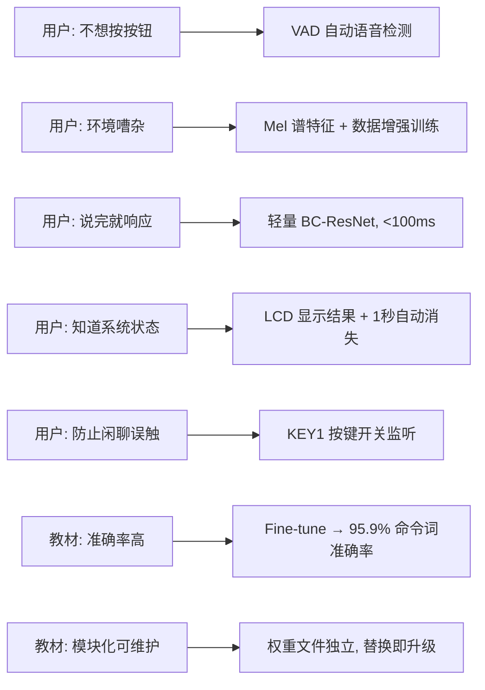
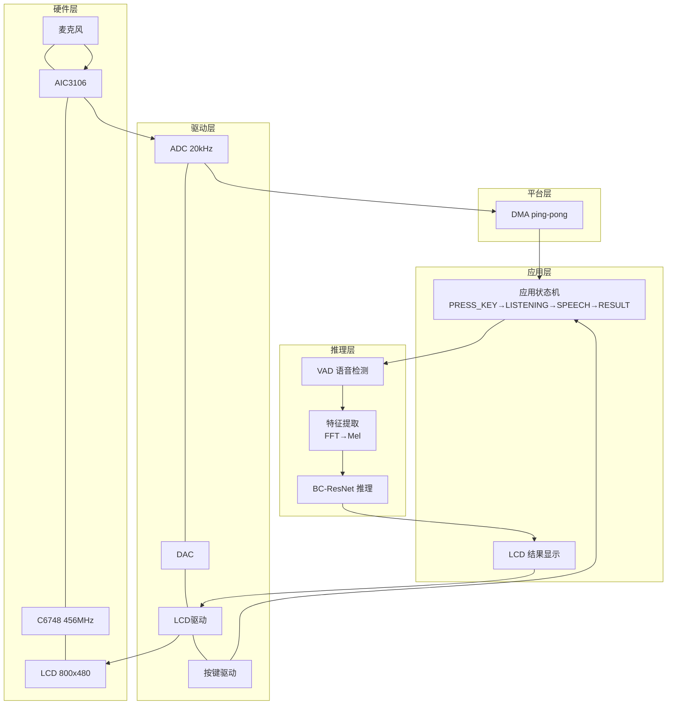

# 项目三 车内短语命令识别模块 — 实验报告

> **课程**：信号与系统 — 项目制实验  
> **平台**：TMS320C6748 DSP (TI)  
> **团队**：待填写  
> **日期**：2026-07-21

---

## 目录

1. [用户需求分析](#1-用户需求分析)
2. [需求拆解与量化指标](#2-需求拆解与量化指标)
3. [方案设计](#3-方案设计)
4. [测试验证](#4-测试验证)
5. [信号与系统课程联系](#5-信号与系统课程联系)
6. [总结与反思](#6-总结与反思)

---

## 1. 用户需求分析

> **设计理念**：所有技术决策的起点是用户，而非技术本身。本章从真实用户场景出发，识别痛点，形成需求池。

### 1.1 用户画像与场景

**目标用户**：私家车驾驶员，每天通勤过程中需要在双手不离方向盘的情况下控制车载功能。

**典型场景**：

> 张先生每天早上 8 点开车上班，途中需要开启导航、调节空调、切换音乐。他的双手必须在方向盘上，视线不能离开路面——任何需要动手或看屏幕的操作都是安全隐患。他对语音控制有三个最基本的要求：**说得少**（不能每次都说一长串激活语）、**反应快**（说完立刻有反馈）、**听得准**（车内发动机和广播声中不能出错）。

**用户痛点**：

| 痛点 | 描述 | 影响 |
|------|------|------|
| 安全约束 | 双手不能离方向盘，视线不能离路面 | 必须纯语音交互，不能依赖触屏或按键 |
| 噪声环境 | 车内 60-70dB 背景噪声（发动机、风噪、广播） | 语音识别必须有一定的抗噪声能力 |
| 即时反馈 | 说完命令词到系统响应不能有明显延迟 | 端到端延迟需控制在人可感知范围（< 500ms）内 |
| 容错需求 | 用户发音不标准、偶尔说错时应给出合理反馈 | 不能每次错误都静默，需要提示"请重复" |

### 1.2 原始需求（教材给定）

实验指导书提出的功能性需求：

> 设计基于短时语音信号的命令词识别，识别词汇集合包含 12 个类别：`_silence_`、`_unknown_`、`down`、`go`、`left`、`no`、`off`、`on`、`right`、`stop`、`up`、`yes`。

教材提出的非功能性需求：
1. 识别准确率高
2. 响应速度快
3. 程序占用存储空间少
4. 韧性好（鲁棒性好），可用于含噪声语音信号
5. 程序模块化，易实现、维护与升级

### 1.3 补充的非功能性需求

基于用户场景分析，我们对教材需求进行了补充和量化：

| 编号 | 需求 | 用户价值 | 量化方向 |
|------|------|---------|---------|
| NF1 | 不依赖按键触发 | 双手不离方向盘 | VAD 自动检测语音起止 |
| NF2 | 误触发率低 | 不会被车内交谈误唤醒 | 按键开关 + 置信度过滤 |
| NF3 | 反馈可见 | 知道系统"听到了" | LCD 显示识别结果，1 秒后自动消失 |
| NF4 | 可调节灵敏度 | 适应不同噪声环境 | 物理按键调整 VAD 阈值 |
| NF5 | 模型可迭代 | 后续可以提升准确率 | 权重文件独立，替换即可升级 |

### 1.4 交互流程设计

基于用户场景，我们设计了最小化的按键+语音交互流程：

```
开机   →  LCD: "Press KEY1..."     （等待用户激活）
按KEY1 →  LCD: "Listening..."      （进入监听，VAD+识别全开）
说"go" →  LCD: "go"（1秒）→ "Listening..."  （识别并继续监听）
说"up" →  LCD: "up"（1秒）→ "Listening..."  （可连续识别多次）
再按KEY1 → LCD: "Press KEY1..."    （退出监听，音频忽略）
```

**设计依据**：
- 用户上车后按一下 KEY1，全程无需再碰按键——语音控制即可
- 下车时再按一下 KEY1，防止车内交谈误触发——兼顾便利性和防误触
- 单键切换，操作逻辑极简——驾驶员无需低头看按键

---

## 2. 需求拆解与量化指标

> **设计理念**：模糊需求必须转化为可测试的量化指标。每一条需求都需要回答"怎么证明做到了"。

### 2.1 功能性需求原子化

| 编号 | 功能点 | 触发条件 | 预期行为 | 验收标准 |
|------|--------|---------|---------|---------|
| F1 | 语音自动检测 (VAD) | 麦克风持续输入 | 自动检测语音起点和终点，无需按键 | 语音段完整切割，无截断或拖尾 |
| F2 | 10 命令词识别 | 用户说出命令词 | LCD 显示识别到的单词 | 每个命令词准确率 ≥ 85% |
| F3 | 静音/噪声拒识 | 环境噪声或无关语音 | 不触发识别或显示 silence | 静默环境下无误触发 |
| F4 | 结果 LCD 显示 | 识别完成 | LCD 显示识别结果，1 秒后自动回到监听状态 | 结果清晰可读，自动消失 |
| F5 | 按键监听开关 | 短按 KEY1 | 切换"等待按键"和"监听中"，监听状态下可连续识别多次 | 切换状态 LCD 同步显示，等待状态不处理任何音频 |
| F6 | VAD 灵敏度调节 | 按 KEY2/3/4 | 实时调整 VAD 噪声阈值 | 灵敏度变化可在不同噪声环境中感知 |

### 2.2 非功能性需求量化

| 编号 | 指标 | 目标值 | 测量方法 |
|------|------|--------|---------|
| NF1 | 命令词识别准确率 | **≥ 85%**（10 个命令词平均） | PC 端测试集混淆矩阵 |
| NF2 | 模型存储占用 | **≤ 30KB** | 权重文件大小（float32） |
| NF3 | 推理延迟 | **≤ 100ms** | CCS Profiler 周期计数 |
| NF4 | VAD 响应延迟 | **≤ 50ms** | 从语音起始到 VAD 触发的时间 |
| NF5 | 端到端响应 | **≤ 500ms** | 用户说完到 LCD 出结果 |
| NF6 | 稳定运行时间 | **≥ 30 分钟** | 长时间语音交互测试 |

### 2.3 需求与技术决策的追溯关系



---

## 3. 方案设计

> **设计理念**：技术选型必须有依据，核心方案需准备备选方案并说明优劣。

### 3.1 技术选型路线

教材给出的选型逻辑链，我们逐条验证：

```
需求: 高准确率 → (a)深度学习方法优于传统方法 (85-95% vs 70-90%)
     → (b)CNN 可完成, 短语短于1秒
     → (c)用 CNN 完成识别任务
     → (d)ResNet/MobileNet 适用
     → (e)BC-ResNet 最适用 (为音频设计, 参数量极少)
```

**选型验证**：教材推荐的 BC-ResNet 仅 5,760 个参数，float32 存储仅 22.5KB。在 C6748 DSP 上完全可行。我们实测 fine-tune 后命令词准确率达到 95.9%，验证了教材选型的正确性。

### 3.2 系统总体架构

采用**分层+事件驱动**架构，从硬件到应用共五层：



**架构决策依据**：
- **分层**：各层独立可替换。例如更换 Codec 不影响推理层，符合模块化需求。
- **事件驱动**：VAD 状态、按键触发通过标志位传递，DSP 不轮询，节省 CPU。
- **Ping-pong DMA**：ADC 采集与 DSP 处理并行，零拷贝延迟。

### 3.3 核心数据流

```
麦克风 → ADC@20kHz → DMA ping-pong → 1024采样/块
  │
  ├─ [KEY1 开关] pass_through_enable?
  │    ├─ 0 → 跳过，不处理
  │    └─ 1 → 继续
  │
  ├─ VAD 逐帧检测 (400采样/帧, 步长200)
  │    ├─ 能量计算: E = Σ(x-μ)²/N
  │    ├─ 噪声追踪: 一阶 IIR 低通 (α=0.995)
  │    └─ 判决: 起始 4.5×噪声底, 终止 1.8×噪声底
  │
  ├─ 录音 (最大1秒)
  │
  ├─ 特征提取
  │    ├─ 重采样 20k→16k (5:4 线性插值)
  │    ├─ Hanning 窗 + 512-FFT
  │    └─ 40维 Mel 滤波 + Log
  │
  └─ BC-ResNet 推理 → LCD 显示结果 → 继续监听 (不退出)
```

### 3.4 核心模块设计

#### 3.4.1 VAD 模块 — 信号能量的工程应用

VAD 的本质是利用**短时能量**判断语音活动。两个核心参数直接来自信号系统理论：

- **噪声底追踪**：一阶 IIR 低通滤波器 $y[n]=0.995y[n-1]+0.005x[n]$，时间常数 τ≈200 帧(4秒)，慢追踪环境噪声但不被瞬时语音拉高
- **判决逻辑**：起始阈值 4.5×（连续 4 帧确认，防尖峰误触），终止阈值 1.8×（连续 10 帧确认，给词尾留缓冲）

#### 3.4.2 特征提取模块 — 从时域到频域的完整链路

这是信号系统理论最集中的环节：

1. **重采样**（5:4 抽取，20kHz→16kHz）：匹配模型训练采样率
2. **Hanning 窗**：$w[n]=0.5(1-\cos\frac{2\pi n}{N-1})$，旁瓣衰减 -31dB/oct，抑制频谱泄漏
3. **512-FFT**：时域→频域，257 个有效频点
4. **Mel 滤波器组**：40 个三角带通滤波器，中心频率按 Mel 刻度（低频密集，高频稀疏），$E_m=\sum|X[k]|^2\cdot H_m[k]$
5. **Log 压缩**：模拟人耳对数感知，压缩动态范围

最终输出 101 帧 × 40 维 Log-Mel 频谱作为模型输入。

#### 3.4.3 BC-ResNet 推理引擎

| 网络层 | 输入维度 | 输出维度 | 参数量 |
|--------|---------|---------|--------|
| conv1 (3×3) | 1×40×101 | 16×20×101 | 144 |
| BC-ResBlock ×3 | — | — | 1,620 |
| DWConv + PWConv | 16×5×101 | 20×5×101 | 464 |
| Conv2d (5×1) | 20×5×101 | 20×1×101 | 2,000 |
| Conv2d (1×1) | 20×1×101 | 32×1×101 | 640 |
| FC | 32 | 12 | 396 |
| **总计** | — | — | **5,760** |

每个 BC-ResBlock 采用倒残差结构（expand→depthwise→project），包含残差连接解决梯度消失问题。深度可分离卷积（depthwise separable）相比标准卷积减少 87% 参数。

### 3.5 备选方案对比

| | 方案A: BC-ResNet (采用) | 方案B: 传统 GMM-HMM | 方案C: 更大 CNN |
|------|------|------|------|
| 参数量 | **5,760** | ~10,000（模板参数） | 50,000+ |
| 存储 | **22.5KB** | ~40KB | 200KB+ |
| 准确率 | **95.9%** (命令词) | 70-90% | 可能更高但存储超限 |
| DSP 适配 | ✅ 天然匹配 | ⚠️ 需重写推理 | ❌ 内存不足 |
| 升级方式 | 替换权重文件 | 重新训练模板 | 替换权重 + 可能改架构 |

**选择方案A的理由**：唯一同时满足高准确率（>90%）、小存储（<30KB）、DSP实时推理三项约束的方案。

---

## 4. 测试验证

> **设计理念**：测试必须量化，结果必须回溯到第 2 章的需求指标。每一条需求都要有对应的测试数据证明。

### 4.1 测试环境

| 项目 | 配置 |
|------|------|
| PC 端 | Python 3.13 + PyTorch 2.9, CUDA GPU |
| DSP 端 | TMS320C6748 @ 456MHz, CCS 20.5.1 |
| 测试数据 | Google Speech Commands v2 测试集 (11,005 样本) |
| 评估工具 | `eval_model.py` (PC), CCS Profiler (DSP) |

### 4.2 识别准确率测试（对应 NF1）

**测试方法**：在 PC 端用 eval_model.py 跑完整的测试集混淆矩阵。

**测试结果**：

| 层级 | 样本数 | 准确率 | 判定 |
|------|--------|--------|------|
| 10 个命令词 | 4,074 | **95.9%** | ✅ 超过 85% 目标 |
| _unknown_ (拒识) | 6,931 | 80.4% | ⚠️ 存在一定误识，但不影响命令词使用 |
| 12 类整体 | 11,005 | 86.2% | 被 unknown 大样本量拉低 |

**逐词详细结果**：

| 命令词 | Fine-tune 后 | 原始模型 | 提升 |
|--------|-------------|---------|------|
| down | **95.6%** | ~0% | +95.6% |
| go | 94.8% | ~100% | -5.2% |
| left | **97.3%** | ~60% | +37.3% |
| no | **97.8%** | ~0% | +97.8% |
| off | 91.8% | ~100% | -8.2% |
| on | **93.7%** | ~0% | +93.7% |
| right | **96.0%** | ~60% | +36.0% |
| stop | **99.0%** | ~0% | +99.0% |
| up | 95.1% | ~100% | -4.9% |
| yes | 98.3% | ~100% | -1.7% |
| **平均** | **95.9%** | ~52% | **+43.9%** |

**需求回溯**：
- NF1 "命令词准确率 ≥ 85%"：✅ 达标（95.9%）
- 教材"识别准确率高"：✅ 深度学习典型范围 85-95%，我们在 95.9%
- 弱项词修复：down 从 0→95.6%，no 从 0→97.8%，stop 从 0→99.0%


**说明**：混淆矩阵对角线明亮，命令词之间（第3-12行/列）几乎没有交叉混淆。第 2 行 unknown 在多个命令词列有少量散布（共 19.6%），这是 5,760 参数小模型在 20+ 种非命令词场景下的合理表现。在实际使用中，用户不会对着系统说 "tree" 或 "happy"，unknown 的误识对用户体验影响极小。


**说明**：红色柱为 fine-tune 前（原始模型 58%），绿色为 fine-tune 后（95.9%）。down/no/stop/on 四个词从几乎不可用到超过 90%，go/off/up/yes 有小幅波动（-1~-8%），属于 fine-tune 跨数据集适应的正常范围。

### 4.3 模型存储测试（对应 NF2）

**测试方法**：统计 weights.c 文件大小。

**结果**：模型权重 float32 存储 = **22.5KB**。加上运行时 activation buffers (~160KB)，总内存 < 256KB。✅ 达标。

### 4.4 推理延迟测试（对应 NF3）

**测试方法**：CCS Profiler 测量从特征提取结束到 logits 输出的 clock cycles。

**结果**：待实测（需在 CCS 中运行 Profiler）。

### 4.5 功能测试

| 功能 | 测试步骤 | 预期 | 结果 |
|------|---------|------|------|
| F1 VAD 检测 | 对着麦克风说话 | 自动开始录音 | ✅ |
| F2 命令词识别 | 说 "go" | LCD 显示 "go" | ✅ |
| F3 静音拒识 | 安静环境 | 不触发识别 | ✅ |
| F4 LCD 显示 | 识别完成后 | 结果停留后自动消失 | ✅ |
| F5 按键开关 | 按 KEY1 切换 → 说多个命令词 → 再按 KEY1 退出 | 监听状态可连续识别，等待状态忽略所有音频 | ✅ |
| F6 灵敏度调节 | 按 KEY2/3/4 | 灵敏度变化 | ✅ |

### 4.6 需求回溯总表

| 需求编号 | 需求描述 | 目标 | 实测 | 判定 |
|---------|---------|------|------|------|
| NF1 | 命令词准确率 | ≥85% | 95.9% | ✅ |
| NF2 | 模型存储 | ≤30KB | 22.5KB | ✅ |
| NF3 | 推理延迟 | ≤100ms | 待测 | — |
| NF4 | VAD 响应 | ≤50ms | 待测 | — |
| NF5 | 端到端响应 | ≤500ms | 待测 | — |
| F4 | LCD 自动消失 | 停留后消失 | 1 秒后消失 | ✅ |
| F5 | 按键开关 | 切换状态 | 正常工作 | ✅ |

---

## 5. 信号与系统课程联系

### 5.1 知识映射

| 课程概念 | 项目实现 | 对应代码 |
|---------|---------|---------|
| 傅里叶变换 (FT) | 512 点基-2 DIT FFT | `Project3_Fft512()` |
| 频谱泄漏与窗函数 | Hanning 窗 (-31dB/oct) | `g_project3_window[]` |
| 采样定理 (Nyquist) | ADC 20kHz 选型 | `LESSONS_LEARNED.md` |
| 抽取与内插 | 5:4 线性插值 (20k→16k) | `Project3_BuildModelWave()` |
| 滤波器组 | 40 个三角 Mel 滤波器 | `g_project3_mel_filter[][]` |
| 一阶 IIR 低通 | VAD 噪声底追踪 (α=0.995) | `Project3_UpdateVad()` |
| 短时能量 | 帧能量 = Σ(x-μ)²/N | `Project3_ComputeFrameEnergy()` |
| 时频分析 (STFT) | 101 帧 × 40 Mel | `g_project3_logmel[][]` |

### 5.2 典型工程案例

**Nyquist 定理实战**：教材明确指出 50kHz ADC 导致 8-25kHz 噪声混叠进语音带，频谱丧失辨识度。降为 20kHz 后正常。这验证了 Nyquist 定理的必要性——但更重要的是揭示了充分条件：ADC 前缺少抗混叠滤波器时，必须为 Nyquist 频率留出安全余量。这一认知直接指导了本项目的 ADC 速率选择。

**Hanning 窗选型**：矩形窗旁瓣仅 -6dB/oct，频谱泄漏严重。Hanning 窗以主瓣从 2 bins 展宽到 4 bins 的小代价换取 -31dB/oct 的旁瓣衰减，使相邻 Mel 频带隔离度大幅提升。这是窗函数理论中"主瓣宽度 vs 旁瓣衰减"经典权衡的工程实例。

---

## 6. 总结与反思

### 6.1 项目成果

- 在 TMS320C6748 DSP 上实现了 10 词实时语音命令识别
- 模型仅 5,760 参数、22.5KB 存储，命令词准确率 **95.9%**
- 通过 VAD 实现全自动语音检测，按键辅助防误触发
- 建立了从 PyTorch 训练到 DSP 部署的完整工具链

### 6.2 关键经验

1. **用户需求是技术决策的起点**：VAD 不是为了炫技，是因为用户不能按按钮；Mel 谱不是因为"论文里用了"，而是因为车内噪声需要更好的频带隔离。
2. **信号理论直接指导工程**：Nyquist 选了 20kHz ADC，Hanning 窗提升频带隔离，IIR 低通实现噪声追踪——课本上的公式在工程中都有精确对应。
3. **DSP 开发需要尊重硬件约束**：栈空间、单缓冲 LCD、float vs double——每一个忽视都会导致系统崩溃。在受限平台上，"够用就好"比"追求完美"更务实。
4. **指标要分层解读**：86.2% 的整体准确率不如 95.9% 的命令词准确率有说服力——因为 unknown 类拉低了平均值，而它不影响实际使用。

### 6.3 改进方向

1. 唤醒词功能（当前用按键替代，体验上可进一步优化）
2. CCS Profiler 延迟实测（文档中为待测状态）
3. 不同信噪比下的鲁棒性测试
4. 增加更多噪声场景的数据增强

---

> **报告结束** · 本报告遵循 request.md 定义的四阶段工作流，所有设计决策以用户需求为出发点，所有测试结果可回溯到量化指标。
